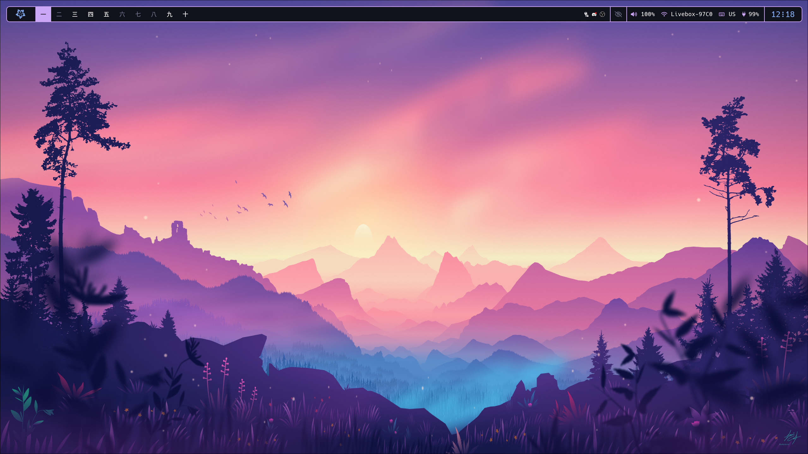

# .dotfiles

All my Linux configuration files. I use this to configure my entire system.

I started out with X server (with AwesomeWM) but recently switched to Wayland (with Hyprland) to try it out.

## 🐧 System setup

- Operating system: [Arch Linux](https://archlinux.org/)
- Display servers:
    - [X](https://www.x.org/), *or Xorg, or X11 (call it what you want)*
    - [Wayland](https://wayland.freedesktop.org/)
- Window managers:
    - [AwesomeWM](https://awesomewm.org/) (on X)
    - [Hyprland](https://hyprland.org/) (on Wayland)
- Compositors: 
    - [picom](https://github.com/yshui/picom) (on X)
    - [Hyprland](https://hyprland.org/) *(Wayland window managers are also compositors)*
- System/status bars:
    - AwesomeWM widgets (on X)
    - [Waybar](https://github.com/Alexays/Waybar) (on Wayland)
- Notification daemons:
    - [naughty](https://awesomewm.org/doc/api/libraries/naughty.html) (built into AwesomeWM, on X)
    - [SwayNotificationCenter](https://github.com/ErikReider/SwayNotificationCenter) (on Wayland)
- Shell: [Zsh](https://www.zsh.org/) (with [Starship](https://starship.rs/) for my prompt)
- Application launchers:
    - [Rofi](https://github.com/davatorium/rofi) (on X):
        - [rofi-emoji](https://github.com/Mange/rofi-emoji)
        - [rofi-calc](https://github.com/svenstaro/rofi-calc)
    - [Wofi](https://hg.sr.ht/~scoopta/wofi) (on Wayland)
- Terminals:
    - [Kitty](https://sw.kovidgoyal.net/kitty)
    - [Alacritty](https://alacritty.org)
    - [Ghostty](https://ghostty.org)
- Text/code editor: [Neovim](https://neovim.io/) (using [kickstart](https://github.com/nvim-lua/kickstart.nvim))
- Audio:
    - Drivers and interface: [ALSA](https://www.alsa-project.org/)
    - Sound server: [PipeWire](https://pipewire.org/)
    - GUI apps:
        - [PulseAudio Volume Control](https://freedesktop.org/software/pulseaudio/pavucontrol/) for simple audio control
        - ~~[QjackCtl](https://qjackctl.sourceforge.io/) for advanced audio stuff~~
- Theming:
    - [Catpuccin](https://github.com/catppuccin/catppuccin) Mocha for my color scheme (I also use [Rigel](https://github.com/Rigellute/rigel) sometimes)
    - [LXAppearance](https://github.com/lxde/lxappearance) to configure my GTK theme
    - [Qt5ct](https://github.com/desktop-app/qt5ct) for apps that use QT toolkit (KDE apps)

## 🖥️ Desktop applications

You can check a detailed list of my preferred apps here: [my-floss/desktop](https://github.com/Coko7/my-floss/blob/main/desktop.md)

## ✨ Inspiration

I did not make all of this myself. A lot of stuff comes from these amazing people:
- [BrodieRobertson](https://github.com/BrodieRobertson/dotfiles): Automatic sourcing of aliases (Youtube: [Brodie Robertson](https://www.youtube.com/channel/UCld68syR8Wi-GY_n4CaoJGA))
- [Derek Taylor](https://gitlab.com/dwt1/dotfiles): Offers great advice on how to manage dotfiles (Youtube: [DistroTube](https://www.youtube.com/channel/UCVls1GmFKf6WlTraIb_IaJg))
- [Phantas0s](https://github.com/Phantas0s/.dotfiles): Solid Zsh setup (without [omz](https://ohmyz.sh/)) and overall nice directory structure (Blog: [The Valuable Dev](https://thevaluable.dev/))
- [ThePrimeagen](https://github.com/ThePrimeagen/.dotfiles): Tailored tmux/vim/fzf tools for a highly productive development workflow ([Twitch](https://www.twitch.tv/theprimeagen), [Youtube](https://www.youtube.com/channel/UC8ENHE5xdFSwx71u3fDH5Xw), [Youtube 2](https://www.youtube.com/channel/UCUyeluBRhGPCW4rPe_UvBZQ))
- [typecraft](https://github.com/typecraft-dev/dotfiles): Mainly stole his Hyprland setup (wofi, waybar) (Youtube: [typecraft](https://www.youtube.com/channel/UCo71RUe6DX4w-Vd47rFLXPg))
