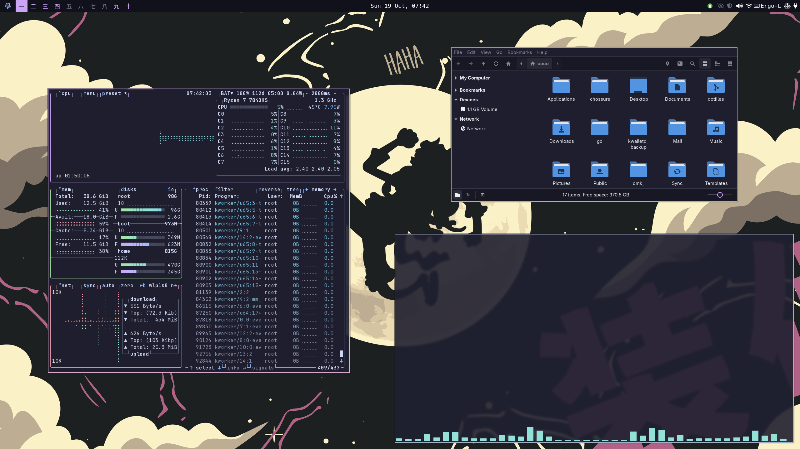

# .dotfiles

All of my Linux configuration files.

## 🐧 System setup

- Disto: [Arch Linux](https://archlinux.org/)
- Display server: [Wayland](https://wayland.freedesktop.org/)
- Window manager: [Hyprland](https://hyprland.org/) (also works as the Compositor)
- System/status bar: [Waybar](https://github.com/Alexays/Waybar)
- Notification daemon: [SwayNotificationCenter](https://github.com/ErikReider/SwayNotificationCenter)
- Shell: [Zsh](https://www.zsh.org/) (with [Starship](https://starship.rs/) for my prompt)
- Application launcher: [rofi-wayland](https://github.com/lbonn/rofi) (fork of [rofi](https://github.com/davatorium/rofi), compatible with Wayland):
- Terminals: [Ghostty](https://ghostty.org), [Kitty](https://sw.kovidgoyal.net/kitty), [Alacritty](https://alacritty.org)
- Text/code editor: [Neovim](https://neovim.io/) (my config: [coko7/nvim-config](https://github.com/Coko7/nvim-config))
- Audio:
    - Drivers and interface: [ALSA](https://www.alsa-project.org/)
    - Sound server: [PipeWire](https://pipewire.org/)
    - GUI apps: [PulseAudio Volume Control](https://freedesktop.org/software/pulseaudio/pavucontrol/) for simple audio control
- Theming:
    - [Catpuccin](https://github.com/catppuccin/catppuccin) Mocha for my color scheme (I also use [Rigel](https://github.com/Rigellute/rigel) sometimes)
    - [LXAppearance](https://github.com/lxde/lxappearance) to configure my GTK theme
    - [Qt5ct](https://github.com/desktop-app/qt5ct) for apps that use QT toolkit (KDE apps)

## 🚀 Custom scripts

To have a Linux experience customized to my liking, I rely on a lot of homemade scripts. If you are curious about them, you can take a look there:
- [.config/scripts/](./.config/scripts): scripts intended to be used by other scripts or linked to keybinds
- [.config/local/bin-sh/](./.config/local/bin-sh): custom bash scripts that I intend to invoke directly from the command line

## 🇽 X.Org Server system setup

Before migrating to Wayland, I was using an X-server based config.
If you are curious, you can check it out [here](./xorg_setup.md).

## 🖥️ Desktop applications

You can check a detailed list of my preferred apps here: [coko7/my-floss](https://github.com/Coko7/my-floss/blob/main/desktop.md)

## ⌨️ Keyboard setup

I have been using ergonomic keyboards for some years now:
- 46 keys Corne: [coko7/crkbd](https://github.com/Coko7/crkbd)
- 60 keys Sofle: [coko7/sofle](https://github.com/coko7/sofle)

## ✨ Inspiration

I did not make all of this myself. A lot of stuff comes from these amazing people:
- [BrodieRobertson](https://github.com/BrodieRobertson/dotfiles): Automatic sourcing of aliases (Youtube: [Brodie Robertson](https://www.youtube.com/channel/UCld68syR8Wi-GY_n4CaoJGA))
- [Derek Taylor](https://gitlab.com/dwt1/dotfiles): Offers great advice on how to manage dotfiles (Youtube: [DistroTube](https://www.youtube.com/channel/UCVls1GmFKf6WlTraIb_IaJg))
- [Phantas0s](https://github.com/Phantas0s/.dotfiles): Solid Zsh setup (without [omz](https://ohmyz.sh/)) and overall nice directory structure (Blog: [The Valuable Dev](https://thevaluable.dev/))
- [ThePrimeagen](https://github.com/ThePrimeagen/.dotfiles): Tailored tmux/vim/fzf tools for a highly productive development workflow ([Twitch](https://www.twitch.tv/theprimeagen), [Youtube](https://www.youtube.com/channel/UC8ENHE5xdFSwx71u3fDH5Xw), [Youtube 2](https://www.youtube.com/channel/UCUyeluBRhGPCW4rPe_UvBZQ))
- [typecraft](https://github.com/typecraft-dev/dotfiles): Mainly stole his Hyprland setup (wofi, waybar) (Youtube: [typecraft](https://www.youtube.com/channel/UCo71RUe6DX4w-Vd47rFLXPg))
